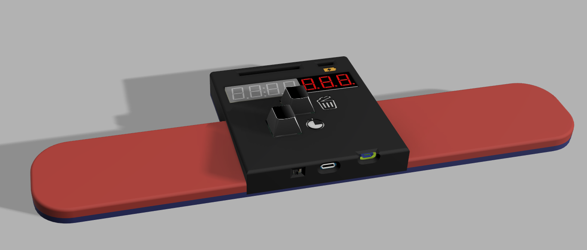
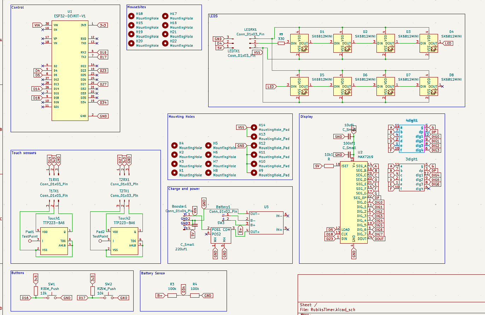
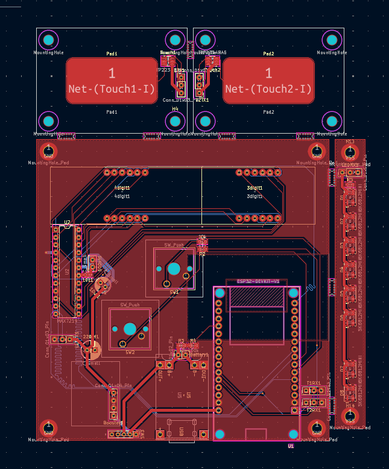
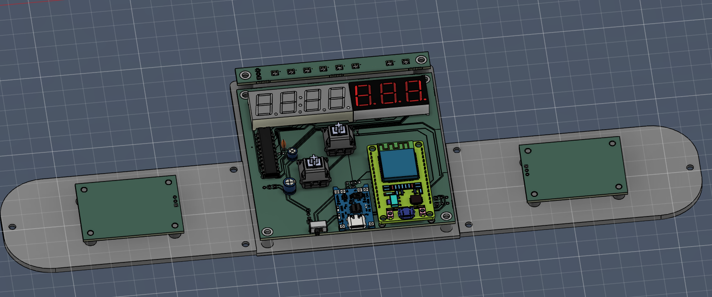

# Rubiks Timer
I'm gonna build a timer to use with my rubiks cube, it will be powered by an esp32 and it will host a webpage to view the times registered.

The device is powered by a rechargable 2000mAh LiPo battery, it shows the time to the millisecond and the status of the timer with a strip of neopixels. There also are two phisical buttons for an easier access to deleting the time and adding a penality.

Full timer:

Electrical scheme:

PCB layout: 

Inernal components placement:
